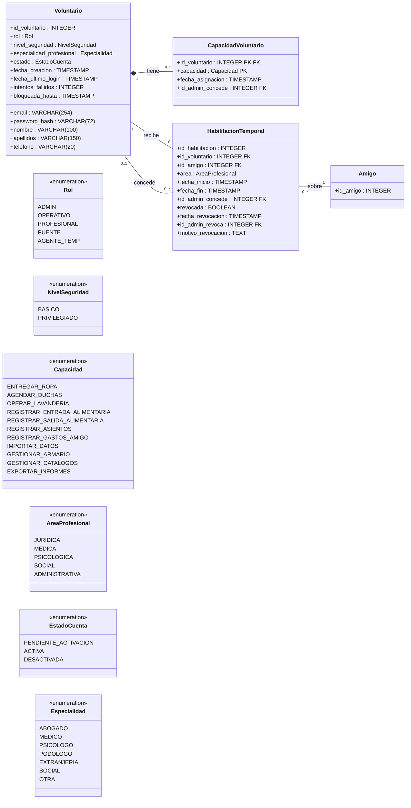

```mermaid
classDiagram
    direction LR

    class Voluntario {
        +id_voluntario : INTEGER
        +email : VARCHAR(254)
        +password_hash : VARCHAR(72)
        +nombre : VARCHAR(100)
        +apellidos : VARCHAR(150)
        +telefono : VARCHAR(20)
        +rol : Rol
        +nivel_seguridad : NivelSeguridad
        +especialidad_profesional : Especialidad
        +estado : EstadoCuenta
        +fecha_creacion : TIMESTAMP
        +fecha_ultimo_login : TIMESTAMP
        +intentos_fallidos : INTEGER
        +bloqueada_hasta : TIMESTAMP
    }

    class CapacidadVoluntario {
        +id_voluntario : INTEGER PK FK
        +capacidad : Capacidad PK
        +fecha_asignacion : TIMESTAMP
        +id_admin_concede : INTEGER FK
    }

    class HabilitacionTemporal {
        +id_habilitacion : INTEGER
        +id_voluntario : INTEGER FK
        +id_amigo : INTEGER FK
        +area : AreaProfesional
        +fecha_inicio : TIMESTAMP
        +fecha_fin : TIMESTAMP
        +id_admin_concede : INTEGER FK
        +revocada : BOOLEAN
        +fecha_revocacion : TIMESTAMP
        +id_admin_revoca : INTEGER FK
        +motivo_revocacion : TEXT
    }

    class Rol {
        <<enumeration>>
        ADMIN
        OPERATIVO
        PROFESIONAL
        PUENTE
        AGENTE_TEMP
    }

    class NivelSeguridad {
        <<enumeration>>
        BASICO
        PRIVILEGIADO
    }

    class Capacidad {
        <<enumeration>>
        ENTREGAR_ROPA
        AGENDAR_DUCHAS
        OPERAR_LAVANDERIA
        REGISTRAR_ENTRADA_ALIMENTARIA
        REGISTRAR_SALIDA_ALIMENTARIA
        REGISTRAR_ASIENTOS
        REGISTRAR_GASTOS_AMIGO
        IMPORTAR_DATOS
        GESTIONAR_ARMARIO
        GESTIONAR_CATALOGOS
        EXPORTAR_INFORMES
    }

    class AreaProfesional {
        <<enumeration>>
        JURIDICA
        MEDICA
        PSICOLOGICA
        SOCIAL
        ADMINISTRATIVA
    }

    class EstadoCuenta {
        <<enumeration>>
        PENDIENTE_ACTIVACION
        ACTIVA
        DESACTIVADA
    }

    class Especialidad {
        <<enumeration>>
        ABOGADO
        MEDICO
        PSICOLOGO
        PODOLOGO
        EXTRANJERIA
        SOCIAL
        OTRA
    }

    class Amigo {
        +id_amigo : INTEGER
    }

    Voluntario "1" *-- "0..*" CapacidadVoluntario : tiene
    Voluntario "1" -- "0..*" HabilitacionTemporal : recibe
    HabilitacionTemporal "0..*" -- "1" Amigo : sobre
    Voluntario "0..1" -- "0..*" HabilitacionTemporal : concede
```